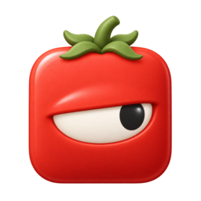
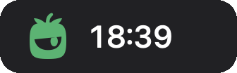
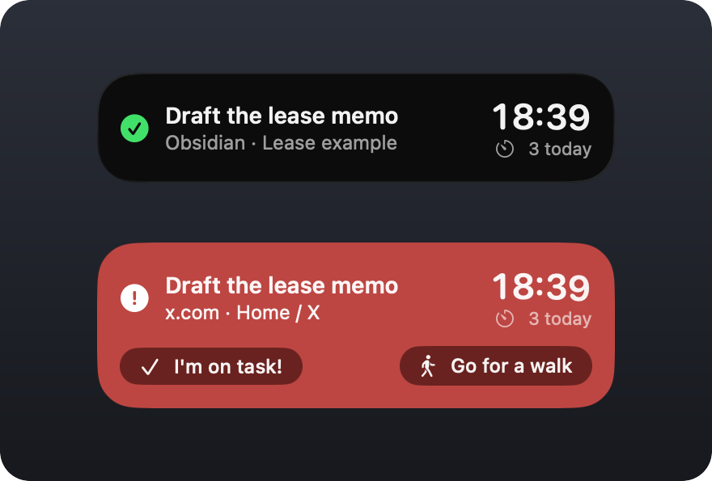

<p align="center">
  
</p>

<h1 align="center">Side Eye</h1>

<p align="center">A pomodoro focus timer for your Mac that notices when you drift.</p>

<p align="center">
  <a href="https://github.com/abromberg/sideeye/releases/latest/download/Side-Eye.zip"><b>Download Side Eye for Mac</b></a><br>
  <sub>macOS 26 or later · <a href="#install">How to install</a></sub>
</p>

<p align="center">
  
</p>

Tell Side Eye what you're working on and start the timer. It watches the windows in front of you, and when you wander off to something that has nothing to do with your task, it turns red. Come back and it calms down again.

It doesn't block anything. It just gives you a look.

<p align="center">
  
</p>

## What you need

- A Mac running macOS 26 or later.
- An [OpenRouter](https://openrouter.ai/settings/keys) API key. Side Eye uses AI models to decide whether a window fits your task. With the default settings, this costs about a cent per hour of focus.

## Install

1. [Download Side Eye](https://github.com/abromberg/sideeye/releases/latest/download/Side-Eye.zip). (On the [Releases](https://github.com/abromberg/sideeye/releases) page, it's `Side-Eye.zip`. You don't need `appcast.xml` or the source code.)
2. Unzip it if your browser didn't already, and drag **Side Eye** into your Applications folder.
3. Open it. A welcome window walks you through three things:
   - **Accessibility**, so Side Eye can see which app and window are in front.
   - **Screen Recording**, for windows that don't expose their text, like PDFs. Side Eye works without it, just with less to go on.
   - **Your OpenRouter key**, which is checked and then saved in your Keychain.

Side Eye checks for updates once a day and asks before installing one.

## Using it

Type what you're working on, like "Draft the lease memo", and press **Start**. Be specific: "Northwind pitch deck" gives Side Eye more to work with than "work".

- **Green** means the window in front fits your task.
- **Yellow** means it probably does. Hover over the floating window to confirm and train it.
- **Red** means you've drifted. If Side Eye is wrong, press **I'm on task!**. That window counts for the rest of the session, and Side Eye learns that windows like it fit the task. If it's right, close the tab, or press **Go for a walk** to end the session.

Sessions are 25-minute pomodoros with 5-minute breaks. You can change the lengths, how strict Side Eye is, and whether the floating window shows everything or just the eye, in Settings.

## Privacy

To work, Side Eye has to look at what's on your screen. Here is what it sends, and when. Everything goes through OpenRouter, and only to providers that don't keep your data.

| What | When | Setting |
| --- | --- | --- |
| Your stated task, the app name, the window title and the web address | Every time the window in front changes during a session | Always |
| Text from the window | When the title isn't enough to decide (Optional) | *Read text in the window when unsure* |
| Text read from a screenshot of the window (the reading happens on your Mac) | When the window had little text to read (Optional) | *Take a screenshot when there's little text* |
| The screenshot itself | When the text still isn't enough (Optional) | *Describe screenshots with AI* |
| Your recent tasks, the windows you've said count, and text from on-task windows | When you start a session, and when you correct it (Optional) | *Learn from your other tasks and corrections*, *Learn what the task is about from text in on-task windows* |

Every setting is in Settings → Privacy, and all of them are on by default.

Before anything leaves your Mac, Side Eye does its best to remove email addresses, phone numbers, card numbers, Social Security numbers and API keys from text, and blacks them out in screenshots. It may not catch everything. It never looks at password managers, Keychain Access or System Settings, and you can add other apps under *Never Look At*.

The data goes directly through OpenRouter to providers that OpenRouter classifies as ["zero data retention."](https://openrouter.ai/docs/guides/features/zdr) There is no Side Eye server that anything passes through first.

Side Eye keeps a log on your Mac of your sessions, the windows it judged and what it decided. It doesn't keep window text or screenshots unless you turn on *Debug mode*. There's no account, no analytics, and no server of ours involved. Besides your AI calls, the only thing Side Eye contacts is GitHub, to check for updates.

## Building from source

You'll need Xcode 26 and [XcodeGen](https://github.com/yonaskolb/XcodeGen) (`brew install xcodegen`).

```sh
git clone https://github.com/abromberg/sideeye.git
cd sideeye
scripts/build.sh --open
```

That builds Side Eye and installs it to `~/Applications`. Builds are signed ad-hoc, so macOS will ask for Accessibility again after every rebuild. To avoid that, sign with your own certificate (see `Config/Signing.xcconfig`).

[docs/development.md](docs/development.md) covers how Side Eye makes decisions, the release process, and the icon pipeline.

## Tuning how it judges

If Side Eye keeps getting a certain kind of window wrong, you can dig into why with `focuseval`, a command-line tool that replays your own sessions and tries changes against them. It's easiest to let a coding agent drive it. Open this repo in Claude Code, Codex or a similar tool and ask something like:

> Read docs/development.md. Side Eye keeps marking my Linear tickets off task when I'm working on "Northwind launch". Use focuseval to find out why and suggest a fix.

## License

Copyright © 2026 Experimental LLC. 

Side Eye is free software under the [GNU General Public License v3.0](LICENSE). 

You can use it, change it and share it, and anything you distribute that's built from it has to be released under the same license, with its source.
